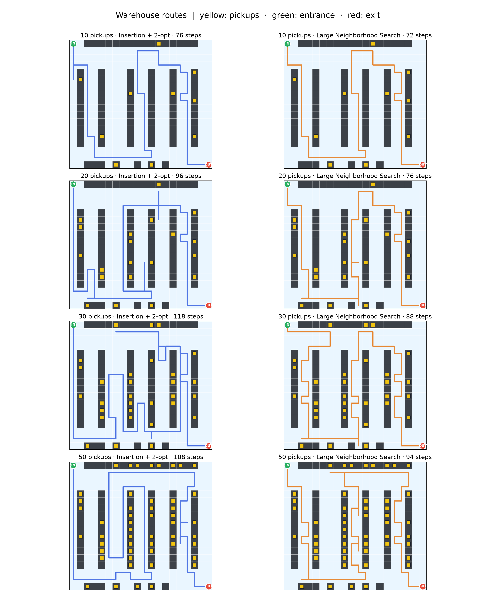

# ทดลองหาเส้นทางหยิบสินค้า

โค้ดทดลองอยู่ใน `optimize_routes.py` และอ่านแผนที่จาก `Creat_warehouse.py` โดยไม่เรียกใช้โค้ดแสดงกราฟในไฟล์เดิม พนักงานเดินบนช่อง `0` ได้สี่ทิศทาง จุดหยิบแต่ละจุดอยู่บนช่อง `1` และหยิบได้จากช่องทางเดินที่ติดกัน

## วิธีที่ใช้

ทุกวิธีใช้ BFS หาทางเดินจริง จึงไม่ใช้ระยะ Manhattan ทะลุชั้นวาง นับลำดับการหยิบเมื่อผ่านช่องที่ติดกับชั้นวางเป็นครั้งแรก

1. **Topic 09 TSP: Cheapest Insertion + 2-opt** เริ่มด้วยทางเข้าและทางออก แล้วเลือกแทรกช่องยืนหยิบที่เพิ่มระยะทางน้อยที่สุด ทำซ้ำจนหยิบครบ หากช่องเดียวหยิบได้หลายจุด จะครอบคลุมทุกจุดนั้น จากนั้นใช้ 2-opt สลับลำดับช่วงทางเดินเมื่อระยะรวมลดลง
2. **Topic 10 Particle Swarm Optimization (PSO)** particle มีค่า `2n` ตัว ครึ่งแรกเรียงลำดับหยิบด้วย random keys ครึ่งหลังเลือกช่องยืนหยิบของแต่ละจุด ถ้าช่องหนึ่งหยิบหลายจุดได้ จะข้ามจุดที่ครอบคลุมแล้ว ใช้ particle 40 ตัว ปรับ 150 รอบ (`w=0.7`, `c1=c2=1.4`) และเก็บคำตอบที่ดีที่สุด
3. **Coverage per Step (วิธีเพิ่ม)** ใช้ BFS จากตำแหน่งปัจจุบัน แล้วเลือกช่องที่ให้สัดส่วน `ระยะเดิน / จำนวนจุดหยิบใหม่` ต่ำสุด ช่องที่ไกลกว่าอาจถูกเลือกถ้าหยิบสินค้าได้มากกว่า เก็บสินค้าระหว่างทางด้วย คำนวณ BFS เฉพาะตอนเลือกจุดถัดไป จึงไม่ต้องสร้างตารางระยะของทุกช่องก่อน
4. **Large Neighborhood Search (LNS)** เริ่มจากวิธีที่ 1 แล้วสุ่มตัดจุดแวะหลายจุด ใส่จุดที่ยังหยิบไม่ครบกลับด้วย Cheapest Insertion จากนั้นลองตัด เปลี่ยน ย้าย และกลับลำดับจุดแวะ โดยรับเฉพาะเส้นทางที่สั้นลงและยังหยิบครบ ทำ 300 รอบด้วย seed `20` และ `21` แล้วเลือกผลที่ดีที่สุด

ทดลองทำ **Lazy BFS** กับวิธีที่ 1 ด้วย: คำนวณ BFS เฉพาะช่องที่ถูกแทรกในเส้นทาง ผลลัพธ์ยังเป็นเส้นทางเดิม แต่ลดเวลาเตรียมข้อมูล นี่เป็นการทำวิธีที่ 1 ให้เร็วขึ้น ไม่ใช่อัลกอริทึมหาเส้นทางอีกชนิด

## ผลลดจำนวนก้าว

ใช้จุดหยิบชุดเดิมทุกวิธี และให้ชุด 10 จุดเป็นส่วนหนึ่งของชุด 20, 30 และ 50 จุด

| จุดหยิบ | Insertion + 2-opt เดิม | LNS | ลดลง |
|---:|---:|---:|---:|
| 10 | 76 | 72 | 4 |
| 20 | 96 | 76 | 20 |
| 30 | 118 | 88 | 30 |
| 50 | 108 | 94 | 14 |

LNS ใช้เวลาคำนวณเพิ่ม: ประมาณ 0.26, 0.66, 1.94 และ 5.24 วินาทีตามลำดับ ผลอาจต่างไปเมื่อเปลี่ยน seed หรือจำนวนรอบ ทุกเส้นทางผ่านการตรวจว่าเดินบนช่อง `0` หยิบครบ และจบที่ทางออก



เส้นที่ทับกันอาจเป็นการเดินซ้ำช่องเดิม จำนวนก้าวในหัวภาพนับการเดินซ้ำทุกครั้ง

## ผลทดลอง

ใช้ seed `20` จุดหยิบ 10 จุดแรกตรงกับไฟล์ต้นฉบับ แล้วเพิ่มจุดในชุดเดิมจนเป็น 20, 30 และ 50 จุด ตารางแสดง `จำนวนก้าว / เวลารวมเป็นมิลลิวินาที` เวลารวมรวม BFS ที่วิธีนั้นจำเป็นต้องเตรียม เป็นค่ามัธยฐานจาก 9 รอบในเครื่องที่ใช้พัฒนา ไม่รวมเวลาอ่านไฟล์และพิมพ์ผล

| จุดหยิบ | Coverage per Step | Lazy Insertion + 2-opt | Insertion + 2-opt เดิม | PSO |
|---:|---:|---:|---:|---:|
| 10 | 84 / 3.70 | 76 / 4.57 | 76 / 8.61 | 88 / 40.81 |
| 20 | 104 / 7.11 | 96 / 9.34 | 96 / 16.34 | 172 / 68.00 |
| 30 | 122 / 10.61 | 118 / 15.74 | 118 / 24.20 | 194 / 95.99 |
| 50 | 126 / 17.15 | 108 / 38.42 | 108 / 46.23 | 386 / 152.44 |

Coverage per Step ใช้เวลาคำนวณน้อยที่สุดทุกขนาด แต่เดินมากกว่า Insertion + 2-opt อยู่ 4–18 ก้าว Lazy BFS ให้จำนวนก้าวเท่าวิธีเดิมทุกขนาดและคำนวณเร็วขึ้นทุกขนาด ที่ 50 จุด Coverage per Step คำนวณเร็วกว่าเดิมประมาณ 2.7 เท่า ส่วน Lazy BFS เร็วขึ้นประมาณ 1.2 เท่า

PSO แบบ random keys หาคำตอบได้ยากขึ้นเมื่อจำนวนจุดเพิ่ม เพราะต้องเลือกทั้งลำดับและช่องยืนหยิบ ผล 50 จุดของวิธีแทรกสั้นกว่า 30 จุด แม้ชุดจุดหยิบจะครอบคลุมกัน เพราะเป็นคำตอบประมาณค่า: วิธีแทรกพบเส้นทางที่ดีกว่าเมื่อมีตัวเลือกเพิ่มขึ้น ไม่ได้แปลว่าระยะที่ดีที่สุดจริงลดลง ทุกวิธีเดินถูกช่อง หยิบครบ และจบที่ทางออก แต่ไม่รับประกันระยะสั้นที่สุดจริง

## วิธีรัน

```bash
python3 optimize_routes.py
python3 optimize_routes.py --counts 10 --details
python3 optimize_routes.py --save-plot route_comparison.png
python3 -m unittest -v test_optimize_routes.py
```

`--details` แสดงลำดับการหยิบพร้อมพิกัดชั้นวาง และเส้นทางทุกช่องจากทางเข้าถึงทางออก ปรับ LNS ได้ด้วย `--lns-iterations` และ `--lns-restarts` ส่วน PSO ใช้ `--particles` และ `--iterations`
